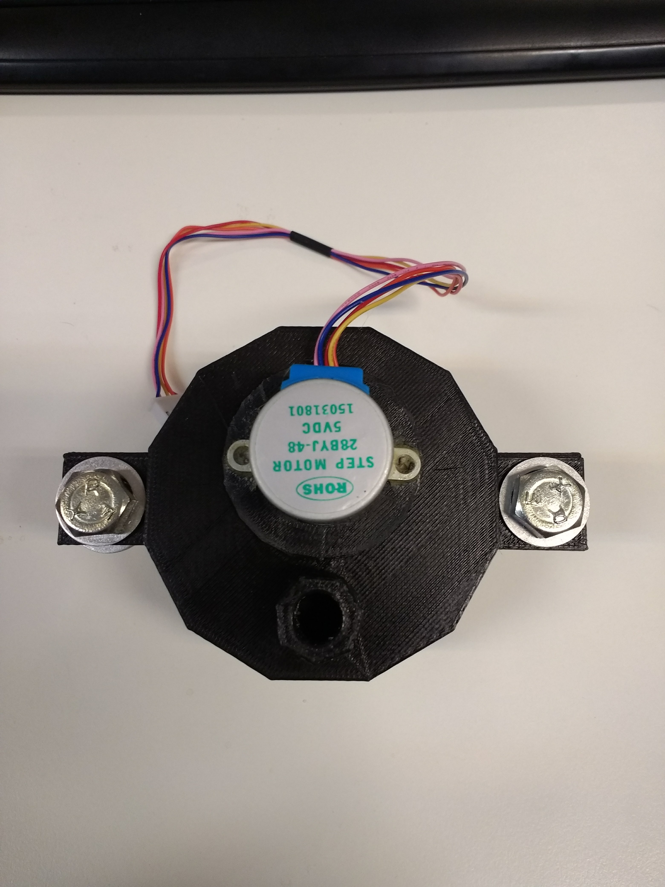
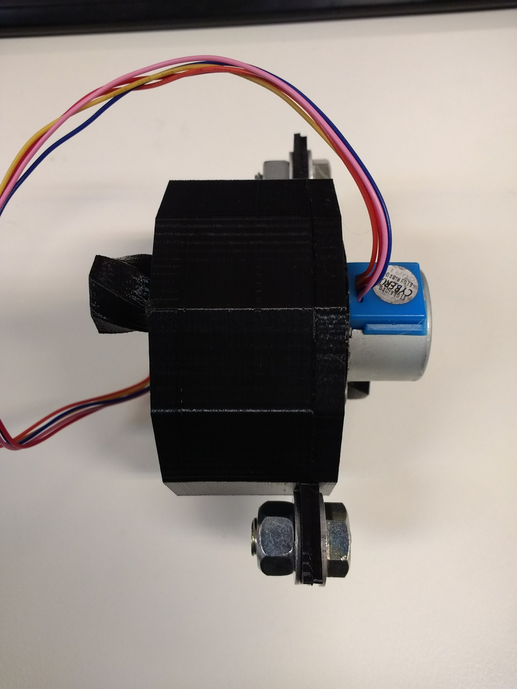
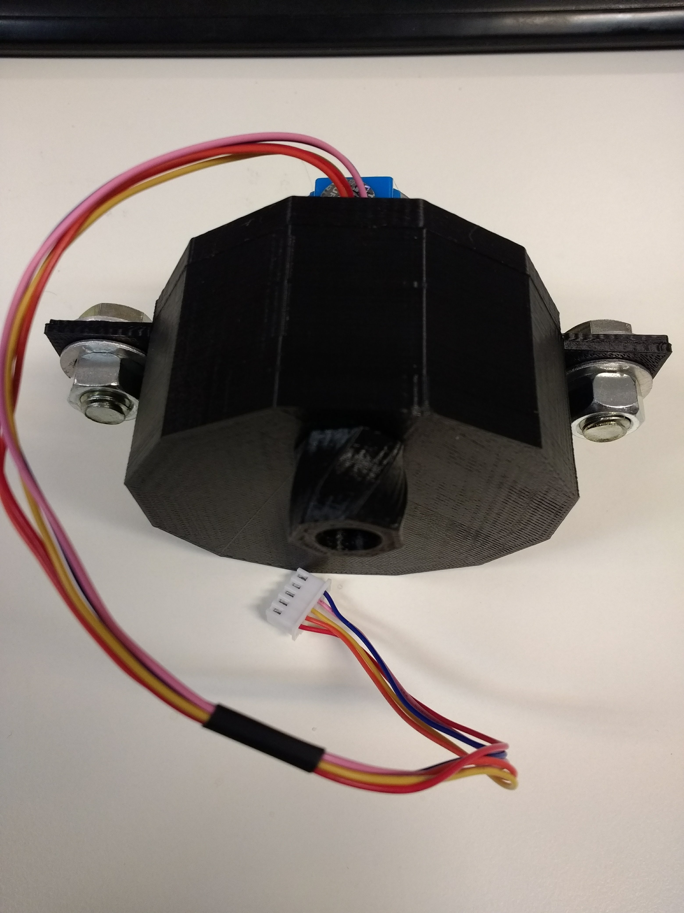
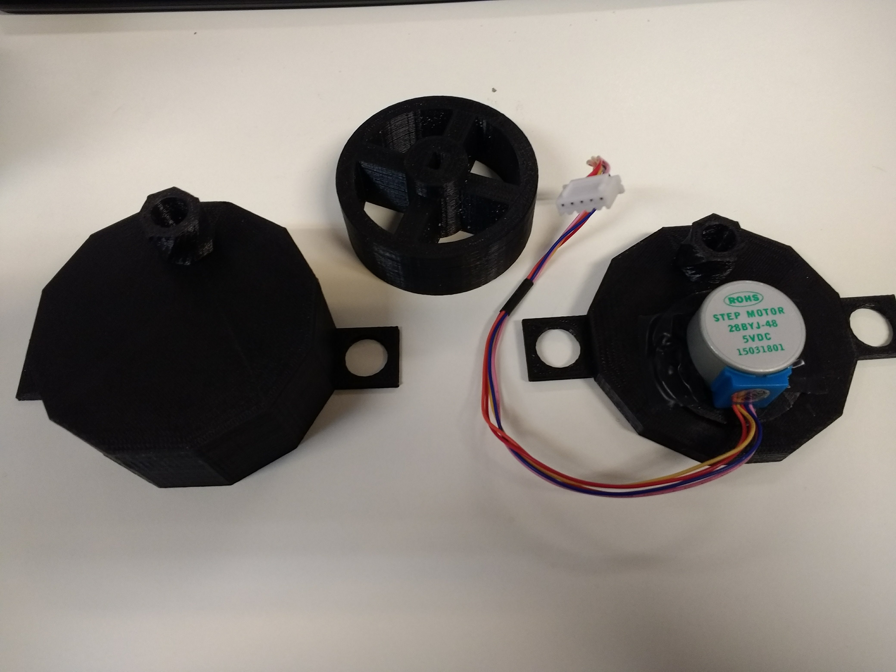

# Dispenser
Sistema para dosificar y administrar productos con forma cristalina, de granulometría no fina. Prototipo desarrollado con tecnologia de impresion 3D, de diseño propio.

### Motor recomendado
28BYJ48

### Driver del motor
ULN2003

### Tornillos:
**Bulones**: ω 3/8 x 5/8, 
**Arandela**: Φ 14 ext 20

## Codigo de exmplo

 - [Arduino](code/dispenser/dispenser.ino)

## Fotos

